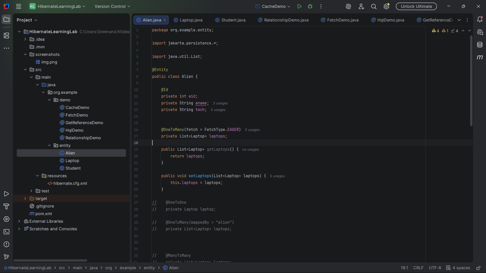
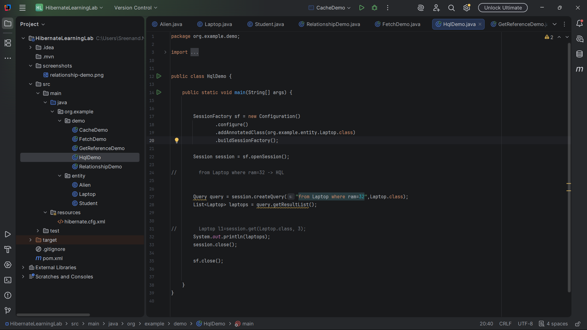
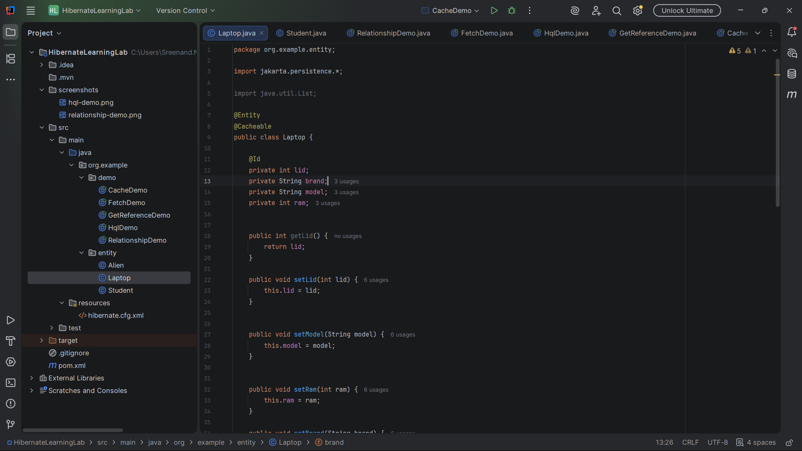

# Hibernate Learning Lab

A Java project demonstrating core Hibernate ORM concepts using PostgreSQL.

This repository was created as part of my backend development learning journey to understand how Hibernate simplifies object-relational mapping (ORM) and database interactions in Java applications.

## Purpose

This repository was built to explore Hibernate ORM fundamentals and understand how Java applications interact with relational databases through object-relational mapping.

The focus was not on building a complete application, but on learning and experimenting with key Hibernate features commonly used in backend development.


## Concepts Covered

### Entity Relationships

* One-to-One Mapping
* One-to-Many Mapping
* Many-to-Many Mapping

### Fetch Strategies

* EAGER Fetching
* Understanding Lazy Loading Concepts

### Hibernate Query Language (HQL)

* Basic HQL Queries
* Parameterized Queries
* Projections (Selecting Specific Columns)

### Entity Retrieval

* `find()` vs `getReference()`
* Hibernate Proxy Objects

### Caching

* First-Level Cache
* Second-Level Cache using `@Cacheable`

---


## Project Structure

```text
HibernateLearningLab
│
├── screenshots
│   ├── relationship-demo.png
│   ├── hql-demo.png
│   └── cache-demo.png
│
├── src
│   └── main
│       ├── java
│       │   └── org/example
│       │       ├── entity
│       │       │   ├── Alien.java
│       │       │   ├── Laptop.java
│       │       │   └── Student.java
│       │       │
│       │       └── demo
│       │           ├── RelationshipDemo.java
│       │           ├── FetchDemo.java
│       │           ├── HqlDemo.java
│       │           ├── GetReferenceDemo.java
│       │           └── CacheDemo.java
│       │
│       └── resources
│           └── hibernate.cfg.xml
│
├── pom.xml
├── .gitignore
└── README.md
```

---

## Demo Modules

| Demo | Concept |
|--------|----------|
| RelationshipDemo | One-to-One, One-to-Many, and Many-to-Many mappings |
| FetchDemo | EAGER fetching behavior |
| HqlDemo | HQL queries, parameters, and projections |
| GetReferenceDemo | Difference between find() and getReference() |
| CacheDemo | First-level and second-level caching |


## Technologies Used

* Java
* Hibernate ORM
* PostgreSQL
* Maven

---

## Key Learnings

* Mapping Java objects to relational database tables
* Managing entity relationships using Hibernate annotations
* Executing database operations using HQL
* Understanding fetch strategies and proxy objects
* Exploring Hibernate caching mechanisms
* Configuring Hibernate with PostgreSQL

---


## Getting Started

### Clone the Repository

```bash
git clone https://github.com/sreenand-n/hibernate-learning-lab.git
```

### Configure Database

Update the database configuration in:

```text
src/main/resources/hibernate.cfg.xml
```

### Run Examples

Run any demo class individually:

```text
RelationshipDemo.java
FetchDemo.java
HqlDemo.java
GetReferenceDemo.java
CacheDemo.java
```

Each demo showcases a specific Hibernate concept.

---

## Screenshots

### Entity Relationships Demo


### HQL Query Demo


### Cache Demo

